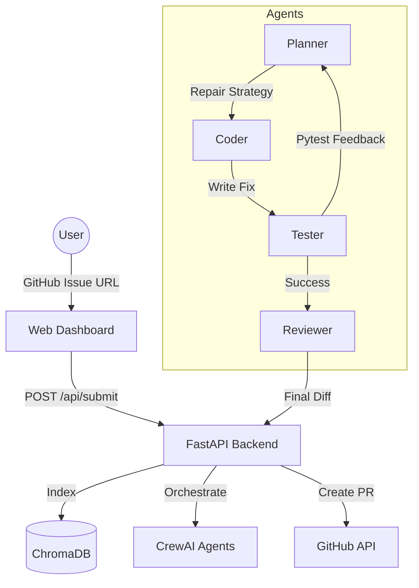

# Autonomous Code Review Agent (AURA) ◈

A production-grade, multi-agent AI system that autonomously resolves GitHub issues. Inspired by Devin, AURA clones repositories, indexes code semantically, plans bug fixes, writes code, and opens Pull Requests automatically.

## 🚀 Features

- **Autonomous Multi-Agent System**: Powered by CrewAI and AutoGen.
- **Semantic Code Retrieval**: Intelligent indexing with ChromaDB and `sentence-transformers`.
- **Self-Correcting Flow**: Automatic retry logic with test-driven feedback.
- **Real-time Dashboard**: Stunning dark-mode UI with live streaming logs and agent activity tracking.
- **Cloud Ready**: Easily deployable to Railway, Render, or Railway via Docker.

## 🏗 Architecture



## 🛠 Tech Stack

- **Backend**: FastAPI, Python
- **Frontend**: Vanilla JS, Modern CSS (Glassmorphism)
- **AI Frameworks**: LangChain, CrewAI
- **Vector DB**: ChromaDB
- **LLMs**: OpenAI GPT-4 / Gemini 1.5 Pro
- **Deployment**: Docker, Railway, Vercel

## 🚦 Getting Started

### Prerequisites
- Python 3.10+
- Docker (optional)
- **GitHub Personal Access Token** (Must have the `repo` scope enabled)
- **OpenAI or Gemini API Key**

### Installation

1. **Clone the repo**:
   ```bash
   git clone <repo-url>
   cd "AI Agent Project"
   ```

2. **Create and Activate a Virtual Environment** (Crucial Step):
   ```bash
   # Windows (PowerShell)
   python -m venv venv
   .\venv\Scripts\Activate.ps1
   
   # macOS/Linux
   python3 -m venv venv
   source venv/bin/activate
   ```

3. **Install dependencies**:
   ```bash
   pip install -r requirements.txt
   ```

4. **Configure Environment Variables**:
   Create a `.env` file in the root folder and add your actual secret keys:
   ```env
   OPENAI_API_KEY=sk-proj-YourOpenAIKeyHere...
   GITHUB_TOKEN=ghp_YourGitHubTokenHere... 
   CHROMA_DB_PATH=./chroma_db
   ```
   *(Note: Whenever you modify the `.env` file, you must restart the backend server!)*

5. **Run the application**:
   ```bash
   python -m backend.main
   ```

6. **Access the Dashboard**:
   Open `http://localhost:8000` in your web browser.

## 🎯 How to Use (Testing the Agent)

1. **Create an Issue**: Go to a GitHub repository you own and open a new Issue describing a bug or a missing feature (e.g., "Add missing docstrings to utils.py").
2. **Copy the URL**: Copy the exact URL of that issue (e.g., `https://github.com/Username/Repo/issues/1`). **Do not** just use the repository `.git` URL.
3. **Run AURA**: Paste the Issue URL into your AURA dashboard and click "Start Autonomous Fix". 
4. AURA will clone your repo, write the code fix, run tests, and automatically open a Pull Request for you!

## ☁️ Deployment

### Railway / Render
1. Connect your GitHub repository.
2. The `Dockerfile` will automatically be detected.
3. Add your environment variables in the dashboard.
4. Deploy!

## 📜 Description
"Developed an autonomous software engineering agent using a multi-agent orchestration framework (CrewAI) and semantic search (ChromaDB). Implemented a self-correcting feedback loop that analyzes GitHub issues, identifies relevant codebase context, generates fixes, and validates changes through sandboxed testing before opening automated Pull Requests. Built a real-time monitoring dashboard with WebSockets for live status tracking."

---

